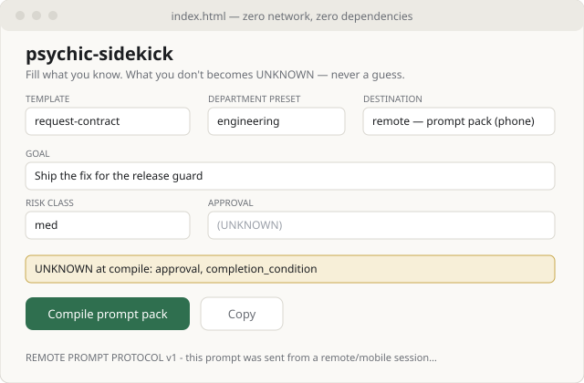

# psychic-sidekick


The Request-Contract front end: a fill-in-the-fields, multiple-choice page that compiles what a
person actually knows into a [psychic-templates](https://github.com/nathan-hayashi/psychic-templates)
contract — and turns everything they *don't* know into an explicit `unknown_fields` list instead
of a guess. The doctrine, mechanized: blank never becomes plausible.

**PUBLIC** since an out-of-band flip after creation (flip date unrecorded — gh pushedAt matches
the birth commit; ratified 2026-08-31, see the VIS-RECONCILE ledger row). Private at creation.

## Quickstart

```bash
git clone https://github.com/nathan-hayashi/psychic-sidekick.git
cd psychic-sidekick && ./scripts/validate-sidekick.sh
```

**Or skip the clone entirely: the hosted page is the same bytes.**
<https://nathan-hayashi.github.io/psychic-sidekick/> serves this repo's `index.html` straight
from the `dev` branch root — no build step, so hosted and local are byte-identical. GitHub
serves the file; the page still never phones home (the suite's self-containment arms prove the
no-network half). Part of the [psychic-crew](https://github.com/nathan-hayashi/psychic-crew)
estate.

Then open `index.html` in a browser — straight from `file://`, or via
`python3 -m http.server 8080` if you prefer a served page. There is no build step, no install,
no network call: one HTML file, one plain-JS core.

## What it does

1. Pick one of **4 templates** (request-contract, high-stakes-task, context-policy,
   audit-checklist) — a curated four of the six the templates repo now defines
   (the UI stays deliberately minimal; the sibling-sync arm proves the four resolve).
2. Optionally pick a department preset (finance / engineering / marketing). **Presets fill
   editable defaults, grounded in the parent program's tier table. They are not policy, and
   nothing here grants approval** — approval is a human act recorded in its own field.
3. Fill what you know. Multiple-choice fields (risk class, approval, yes/no gates) only offer
   legal values; everything else is free text. A live strip shows exactly what will compile
   as UNKNOWN.
4. Pick a destination — **2 lanes**: *local* compiles the plain contract, *remote* wraps the
   same contract in the REMOTE-PROMPT-PROTOCOL preamble, a prompt pack for a phone-declared
   session. Compile, copy, paste. The contract is the interface.

## What it looks like



## From your phone

The page is touch-ready — 16px inputs so mobile browsers never zoom-jump, 44px tap targets, a
sticky compile bar — and still zero-network: open the same `index.html` on the device however
you already move files; nothing is served, nothing phones home. Compile in the *remote* lane
and paste the pack into Claude mobile: the preamble tells that session to run to completion and
record judgment calls as ESCALATION lines instead of stopping to ask. The law lives in
`docs/REMOTE-PROMPT-PROTOCOL.md`, including its honesty section — nothing mechanical proves a
mobile session honors the preamble.

## What is not asserted

Two halves are stated rather than promised away: nothing mechanical proves a mobile session
honors the remote preamble (`docs/REMOTE-PROMPT-PROTOCOL.md` §5), and whether a request matches
a template at all is judgment. The suite binds everything else it names.

## The vocabulary is vendored, not invented

`vendor/SCHEMA-FIELDS.txt` carries the **22 fields** of the psychic-templates canonical schema.
The validator sync-checks it against a sibling checkout when one is present (set
`PSYCHIC_TEMPLATES_PATH` or keep the two repos side by side); drift is a FAIL, not a fork.
`docs/INTEGRATION-CONTRACT.md` declares the full coupling.

## Verification

`./scripts/validate-sidekick.sh` — structure, vocabulary bindings both directions,
self-containment (zero external references, zero network APIs), the doctrine verbatim, node
behavioral tests when node is present (stated SKIP when not), sibling sync, hygiene, README
count bindings, negative controls proven to fire against planted fixtures, the phone-surface
static arms (the width query, the 16px/44px/sticky laws, the 2-lane count by two anchors, an
overflow scanner fire-probed with a planted 900px div), and browser render checks — page DOM
plus a phone-viewport fit meter measured in-engine — whenever a browser binary is already on
the host (stated SKIP otherwise; those legs are the operator machine's drill).
